# Análisis estadístico de los feminicidios en Uruguay (2001-2019) 

```{r include=FALSE}
knitr::opts_chunk$set(echo = FALSE, message = FALSE, warning = FALSE, fig.pos = "h")
```

El capítulo presenta, en primer lugar, un análisis descriptivo a partir de los datos de los feminicidios ocurridos en Uruguay entre 2001 y 2019. Luego se analiza la existencia de
autocorrelación espacial en los datos, de manera de detectar zonas donde se concentren más los feminicidios. Posteriormente, se modeliza la relación entre la tasa de feminicidios y el nivel socioeconómico a distintos niveles de agregación geográfica. Este análisis se repite para un subconjunto de los feminicidios, aquellos ocurridos en la vivienda de la mujer asesinada. En este caso, a medida que el área considerada es más pequeña, es más probable que las características socioeconómicas de ésta sean parecidas a las de la víctima. La segregación residencial muestra que los hogares más pobres o los más ricos se encuentran concentrados en determinados lugares. El procedimiento se realiza por separado entre Montevideo y el interior del país.


## Análisis descriptivo


En este apartado se realiza un análisis descriptivo de los datos, para dar cuenta de la
evolución de la cantidad y tasa de feminicidios a nivel del total país, por departamento y según tamaño de la localidad, para el período 2001-2019. Asimismo, se analizan algunas características de las mujeres asesinadas y su relación de parentesco con el feminicida de manera de cuantificar cuántos feminicidios ocurrieron en el marco de relaciones de pareja, la existencia de parejas abusivas y la identidad de género de las víctimas entre otras cuestiones de interés.

Durante el período considerado se produjeron en Uruguay 532 feminicidios, con un promedio
anual de 28,7 feminicidios, mientras que, la tasa de feminicidios promedio anual del período es 1,6 feminicidios por cada 100.000 mujeres. Dado que la población de mujeres en Uruguay no varió sustancialmente en el período considerado, el comportamiento de la tasa de feminicidios anual es similar al de las frecuencias absolutas. La evolución de la cantidad de feminicidios se observa en el Gráfico 3, el fenómeno parece comportarse relativamente estable en el tiempo, más allá que ocurren algunas variaciones significativas interanuales.

En particular, para los primeros tres años del período considerado, los casos son alrededor de la mitad de los ocurridos en los años inmediatamente posteriores. Estas variaciones, podrían reflejar problemas de relevamiento, más que descensos y aumentos abruptos de la cantidad de casos, por ejemplo, un subregistro de los casos para esos primeros años^[Es importante recalcar que recién a partir de 2001 se comienza a sistematizar la información acerca de los feminicidios ocurridos en Uruguay por parte de la ONG Caminos, por lo tanto, es esperable que los primeros años haya sido más dificultoso el relevamiento.]. En este sentido, si descartamos los primeros tres años, se produce un aumento en ambos indicadores: el promedio asciende a 30,4 feminicidios por año y la tasa promedio anual asciende a 1,7. De todos modos, se puede concluir que la magnitud del fenómeno no se ha modificado significativamente en el período estudiado y oscila entre 1,6 y 1,7 feminicidios por cada 100.000 mujeres. 

<!-- grafico 3  -->
```{r , fig.cap="Evolución de la cantidad de feminicidios y su tasa (2001-2019)", fig.asp=0.5}

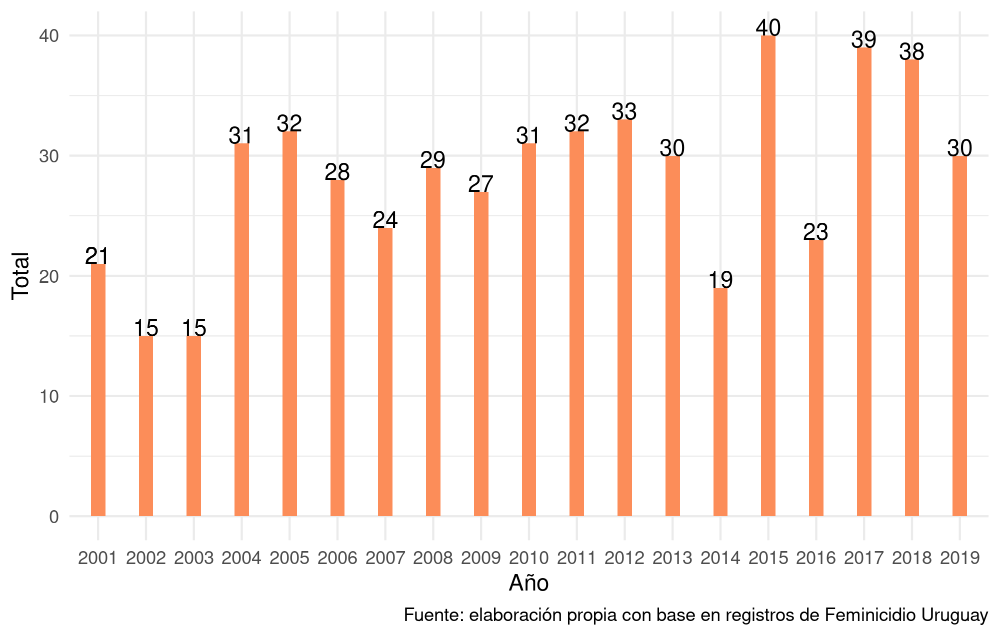
```

Respecto a la localización de los feminicidios, estos no se producen uniformemente a lo
largo y ancho del país. A nivel de departamentos, la tasa promedio del período varía entre 0,76, registrada en Río Negro, y 3,88 en Treinta y Tres. Es precisamente, en la región noreste (Treinta y Tres, Cerro Largo, Rivera), junto con Flores donde se registran las tasas más altas, en todos los casos superiores a 2 feminicidios cada 100.000 mujeres (Gráfico 4).

Las tasas de feminicidio a nivel departamental pueden estar escondiendo diferencias a
nivel de localidades. Resulta interesante analizar que sucede según el tamaño de las localidades y según sean urbanas o rurales. En general, los servicios públicos, incluidos los del SRI, se concentran en las ciudades más pobladas. A su vez, las acciones de sensibilización y campañas informativas tienen un alcance acotado, aunque procuren alcanzar a todo el territorio nacional.

Del cálculo de la tasa de feminicidios según el tamaño de la localidad donde ocurrió, se
obtiene que la tasa de feminicidios más alta se registra en las localidades urbanas que tienen entre 1.000 y 5.000 habitantes (Gráfico 5). Esto es, localidades pequeñas que, por lo general, no cuentan con un servicio específico de atención a situaciones de VBG, de hecho de los 33 servicios de atención del Inmujeres sólo 2 se encuentran en localidades de menos de 5.000 habitantes.

<!-- grafico 4 -->
```{r, fig.cap="Tasa de feminicidios promedio por departamento (2001-2019)", fig.asp=0.6}

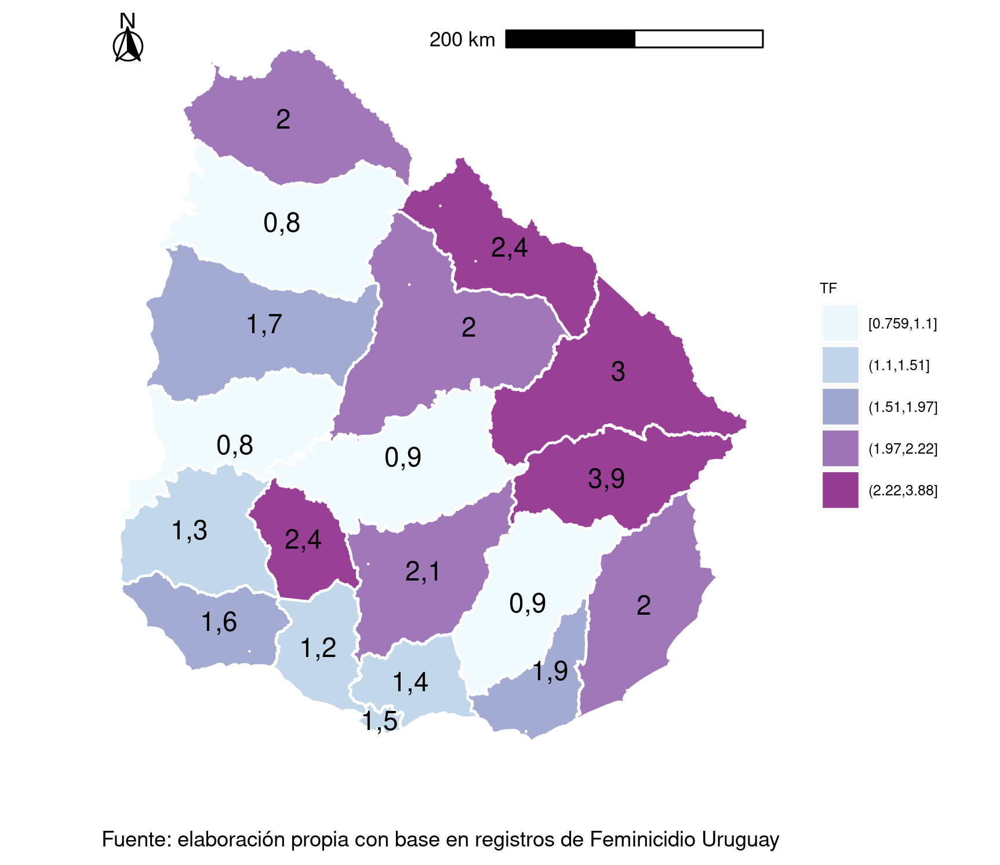
```

Se produjeron en el período 59 feminicidios en 36 localidades pequeñas, es decir, que tienen entre 1000 y 5000 habitantes. Las localidades con más feminicidios registrados son: Toledo (5) en Canelones, Ciudad del Plata (3) en San José, Fray Marcos (3) en Florida y Vergara (3) en Treinta y Tres. La segunda tasa más alta se registra en la zona rural donde las mujeres están más desamparadas y el Estado está más ausente. Si bien, tiene sentido que la mayor cantidad de servicios se encuentren en las ciudades con mayor población porque allí es mayor la población objetivo, los servicios de atención a situaciones de VBG podrían considerarse un servicio básico (como una policlínica, una escuela o la sucursal de un banco) y, por ende, tener presencia en un mayor número de localidades, facilitando el acceso a las mujeres que los requieran. A su vez, la población de los poblados pequeños, suele ser más conservadora que la de las capitales departamentales en cuanto a los estereotipos de género, los mandatos sociales, la naturalización de la violencia en la pareja y donde la división sexual del trabajo está más marcada. Todo lo anterior podría estar generando una menor autonomía de las mujeres que allí residen.

En cuanto a la temporalidad de los feminicidios, éstos no ocurren uniformemente en el
transcurso del año. Para el período analizado, los meses más frecuentes fueron: marzo (52), diciembre (51) y mayo (51). Es decir, que el fenómeno presenta cierta estacionalidad, con valores altos a principio y fin del año y valores más bajos en el tramo intermedio. Respecto a los días de la semana, no se encuentra un patrón tan claro de días más frecuentes: durante el fin de semana ocurrieron el 31% de los casos, si se incluye el viernes se llega al 45%^[Este dato es muy sensible a la calidad de la información respecto al día de ocurrencia del hecho.].

<!-- grafico 5 -->
<!-- grafico 4 -->
```{r, fig.cap="Tasa de feminicidios según tamaño de la localidad (2001-2019)", fig.asp = 0.5}

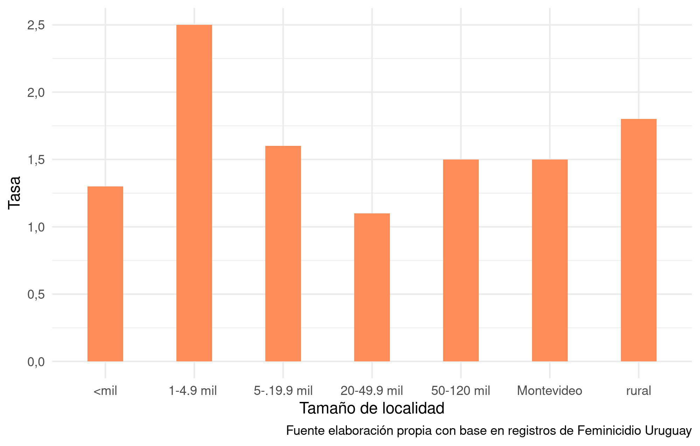
```

Respecto a las características de las mujeres asesinadas, encontramos que 522 corresponden a feminicidios de mujeres cisgénero y 10 a mujeres trans. Respecto a la edad de estas mujeres, se observa una mayor incidencia de los feminicidios en mujeres jóvenes y en edad reproductiva, siendo la tasa para los tramos 18-24, 25-34 y 35-44, superior a 2 feminicidios cada 100.000 mujeres, mientras que en los restantes tramos de edad es inferior a 1,6. En particular, en casi la mitad de los feminicidios, 243, la mujer asesinada tenía entre 25 y 44 años (Gráfico 6). Los registros actuales no permiten identificar cuántas de estas mujeres tenía hijas/os o personas a cargo (este dato está subregistrado).

<!-- grafico 6 -->

```{r, fig.cap="Tasa de feminicidios por grupo etario (2001-2019)", fig.asp=0.5}

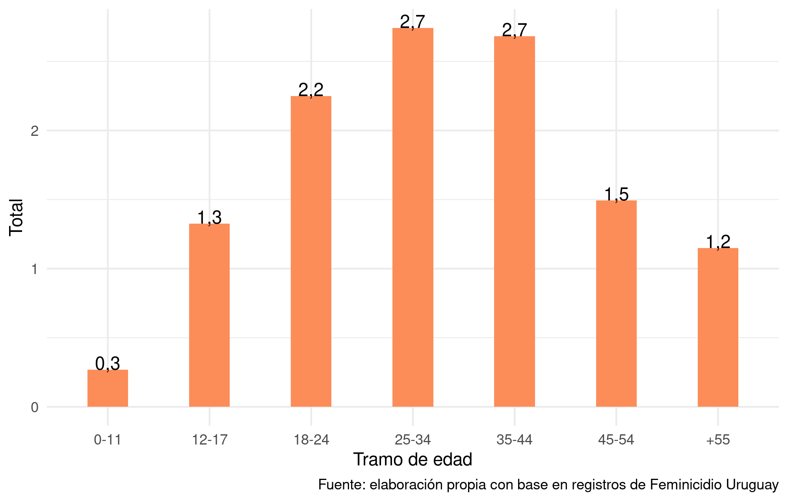
```

Analizar el vínculo entre el feminicida y la mujer asesinada arroja resultados en sintonía con las investigaciones ya mencionadas (Gambetta y Coraza, 2017; Gambetta, 2018; Castro Vignoli, 2019 y Gularte et al., 2020), de los feminicidios aclarados, el 81% fueron cometidos por la pareja o ex-pareja de la mujer asesinada y un 11% por algún familiar. Esto muestra claramente una de las características más terribles de los feminicidios: las mujeres son asesinadas a manos de un varón de su círculo íntimo (Gráfico 7). Estos feminicidios revisten características particulares, ya que al ser cometidos por la pareja o ex-pareja, implican un conocimiento mutuo previo, una relación sexo-afectiva y, en muchos de los casos, años de convivencia y de violencia. En el caso de los feminicidios familiares, los más frecuentes son los perpetrados por el padre/padrastro, en estos casos es común que la víctima sea menor de edad y al crimen le precedan situaciones de abuso sexual crónico. Un 64,4% de estos feminicidios ocurrieron en la vivienda de la víctima, en algunos casos compartida con el agresor hasta ese momento o en el pasado (Gráfico 8). Las mujeres tenían en promedio 38,6 años, en particular, la mitad de ellas era menor a 36 años.


<!-- grafico 7 -->

```{r, fig.cap="Vínculo entre el feminicida y la mujer asesinada", fig.asp = 0.6}

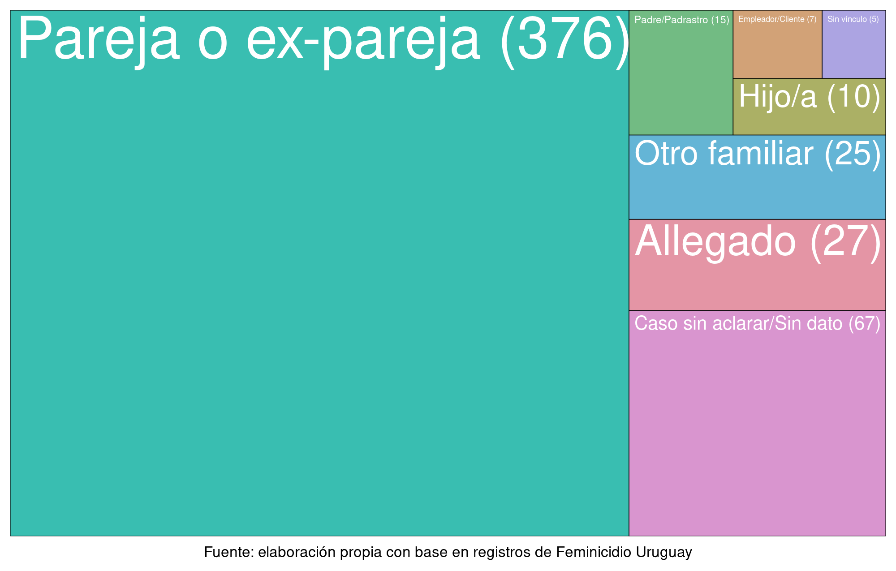
```

Respecto al vínculo con el feminicida si solo consideramos los casos donde la víctima era
una mujer trans, ya no prevalecen los feminicidios donde el asesino era la pareja o ex-pareja. De los 10 casos considerados, en 7 se desconoce la autoría del crimen, es decir, que en el 70% de los casos estos crímenes están sin resolver, con feminicidas impunes, lo que refleja la marginación social a las que estas mujeres estuvieron expuestas. A su vez, 6 de las mujeres trans asesinadas ejercían el trabajo sexual. Tal como lo refleja el Censo de Personas Trans (2016), la realidad de las mujeres trans en Uruguay es de extrema vulnerabilidad, una vida marcada por la expulsión temprana del seno familiar y otros ámbitos de socialización (sistema educativo, empleo formal, etc.), donde el trabajo sexual es una de las pocas opciones que tienen para obtener ingresos (MIDES, 2016).

<!-- grafico 8 -->

```{r, eval = TRUE, fig.cap="Lugar del feminicidio según vínculo del feminicida con la mujer", fig.asp=0.6}

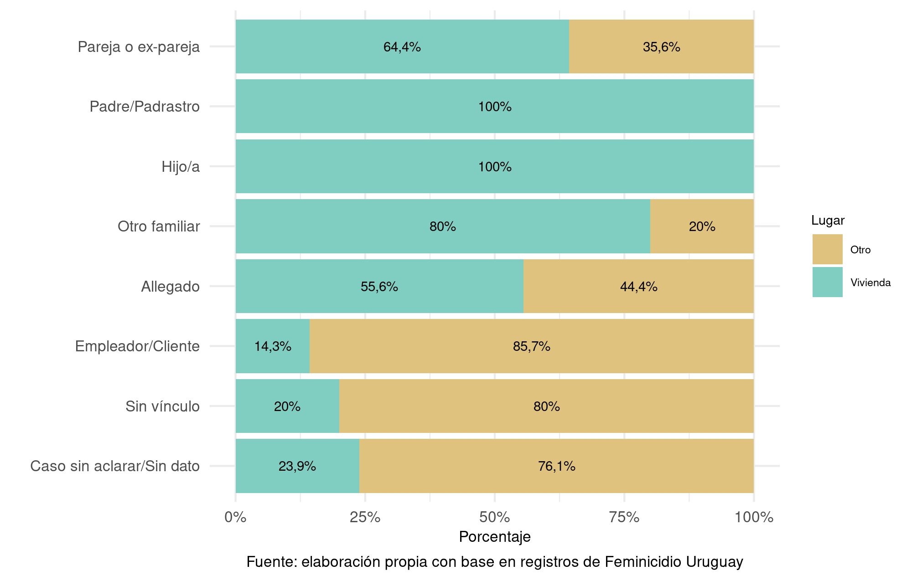
```

Si se consideran solamente los feminicidios perpetrados por la pareja o ex-pareja de la
mujer asesinada, en el 38% de los casos, el feminicida se suicidó o intentó suicidarse luego de cometer el crimen. Esta característica es un patrón bastante frecuente en este tipo de feminicidios y como se analizó en el Capítulo 1, se denominan suicidios machistas. Se producen cuando la mujer quiere terminar la relación de pareja o ésta ya terminó, el feminicidio es una forma de negación de esta situación, pero al mismo tiempo una vez que se produce ese varón ya no tiene razones para vivir. Al considerar solamente los feminicidios perpetrados a menores de edad (12 casos), si se analiza el parentesco con el feminicida encontramos que un 22% fue asesinada por su padre o padrastro, mientras otro 22% fue asesinada por su pareja o ex-pareja y en un 2,9% de estos casos, la menor estaba en una pareja abusiva^[Este problema de desigualdad de género permanece bastante en penúmbras y no hay una medición al respecto. Podemos aproximarnos mediante el Censo 2011 para dar cuenta de la magnitud de parejas abusivas en todo el país. La ECH presenta limitaciones para captar este fenómeno al igual que la EVBGG, ya que solo relevan información de las mujeres a partir de los 15 años. De las mujeres menores de edad que declaran vivir en pareja en nuestro país, en un 92% de los casos el hombre es mayor de edad y en un 16% de los casos (718 de 4555 casos), su pareja es un hombre 10 o más años mayor. Si flexibilizamos la medida, obtenemos que la mitad de estas adolescentes tienen una pareja, con la cual convive, al menos 5 años mayor.]. Este concepto se introdujo en el capítulo 1, significa que, el varón era un adulto al menos 10 años mayor que ella. Este último dato podría esta subregistrado, ya que en casi la mitad de los casos no se cuenta con información sobre la edad del feminicida al momento de cometer el crimen, ya sea por problemas de la base o porque se trata de casos sin aclarar.

En resumen, las mujeres son asesinadas en mayor medida por su pareja o ex-pareja y el
crimen es cometido en su propia casa. Casi la mitad de estos feminicidas se suicida
inmediatamente después de cometer el crimen. Como indica la literatura, este tipo de
feminicidios se dan en el marco de situaciones de VBG, generalmente, de larga data que puede incluir convivencia/matrimonio e hijas/os en común. En cuanto a la territorialidad, los feminicidios se producen en mayor medida en localidades pequeñas de entre 1000 y 5000
habitantes o en zonas rurales.


## Análisis espacial de los feminicidios


A modo de profundizar el análisis de los feminicidios del período analizado y responder
algunas de las preguntas que guían la investigación, a través de la georreferenciación de los feminicidios, se busca obtener una distribución espacial de éstos e indagar sobre un posible patrón espacial de los datos en relación con el territorio caracterizado por su nivel socioeconómico. Actualmente las estadísticas oficiales dan cuenta de los feminicidios por departamento y las estadísticas no oficiales incluso detallan el lugar específico del feminicidio. Sin embargo, en un nivel macro o muy micro es difícil encontrar patrones que revelen una mayor incidencia del feminicidio en ciertas zonas. Como característica principal a ser considerada en estas áreas de estudio, se utiliza el nivel socioeconómico de las personas que residen en dichos territorios. Contar con la ubicación exacta del lugar donde ocurrieron los feminicidios permite analizar esta información desde diferentes ángulos. A su vez, es posible analizar ese punto en un territorio como un espacio más amplio que nos permita caracterizar la zona, esto es, definir el barrio, segmento o sección censal donde ocurrió el crimen para complementar la información con la situación socioeconómica promedio de los hogares o personas de la zona definida. Dadas las limitaciones de la fuente de información principal, este análisis se hará por separado entre Montevideo y el interior del país. Para Montevideo la ECH permite estimar la incidencia de la pobreza con cierta precisión a nivel de municipios, CCZ y barrios cuando se agrupan encuestas de diferentes años y reponderan los casos. Para el interior no es posible hacerlo a un nivel más desagregado que el departamento, por lo tanto, pierde sentido este análisis. La alternativa adoptada es estimar la incidencia de NBI a nivel de segmento censal, a partir de los datos del Censo 2011^[El Censo de población releva características estructurales de las personas y los hogares, por lo tanto, no se miden
ingresos y, por ende, no se puede estimar la incidencia de la pobreza. Los ingresos a diferencia de los bienes de confort o las características de la vivienda de un hogar, presentan una volatilidad mucho mayor en el corto plazo por ese motivo no se consideran como una medida estructural de nivel socioeconómico.].


### Distribución de los feminicidios en Montevideo y relación con la Incidencia de la Pobreza

En primer lugar, se define como nivel de agregación la unidad administrativa municipio^[A partir del año 2010, con la Ley de Descentralización Política y Participación Ciudadana Uruguay se crea un tercer nivel de gobierno y administración: los Municipios. En Montevideo la nueva división política administrativa define 8 municipios, quedando todo el territorio del departamento dividido en municipios.] pero con pequeñas modificaciones. Dado que algunos barrios se encuentran en más de un municipio, o que algunos de estos son heterogéneos socioeconómicamente, se optó por asignar la totalidad del barrio al municipio que aporta una zona territorial mayor y dividir el Municipio E en dos (Norte y Sur), ya que incluye algunos de los barrios más ricos de Montevideo y otros de nivel medio. En la Tabla 4 se muestra la conformación final de barrios en cada municipio.

<!-- tabla 4 -->

```{r, fig.pos="H", fig.cap ="Delimitación de Municipios"}
library(knitr);
library(kableExtra)
tab <- read.csv("cuadros/municipios_barrios.csv")
kable(tab, format = "html", booktabs = TRUE, caption = "Delimitación de Municipios de Montevideo") %>%
  kableExtra::kable_styling(font_size = 12, latex_options = c("striped", "hold_position")) %>%  column_spec(column = 1, width = "3cm", border_right = F) %>% 
  kableExtra::footnote(general = "elaboración propia",footnote_as_chunk = T, general_title = "Fuente:")
```


En el Gráfico 9 se mapea para cada año la Incidencia de la Pobreza en Personas (IPP) a nivel de municipios y los puntos donde ocurrieron los feminicidios. El área del municipio se colorea más clara si la IPP es más baja y más oscura conforme ésta aumenta. Debido a que para Montevideo los feminicidios están georreferenciados casi en su totalidad solo a partir de 2010, se utilizan los datos del período 2010-2019. Se distinguen los puntos con diferente color según el feminicidio ocurrió en la vivienda (rojo) de la víctima o en otro lugar (celeste). Para los feminicidios que ocurrieron en la vivienda podemos suponer que las características del territorio, conforme es más pequeño, es más homogéneo y, por ende, el nivel socioeconómico promedio de las personas que lo habitan es similar al de la mujer asesinada. A su vez, estos feminicidios revisten características particulares, en la mayoría de los casos fueron cometidos por la pareja o ex-pareja de la mujer, y por ende, las medidas de política pública deberían tomar en cuenta estas particularidades. Se obtiene que aproximadamente 7 de cada 10 feminicidios ocurrieron en los municipios de menor nivel socioeconómico: A, D, F (todos con una IPP promedio del período de al menos 20%), G, y EN.


<!-- grafico 9 -->

```{r, fig.cap ="Incidencia de la pobreza por municipio de Montevideo", fig.asp =0.4}

knitr::include_graphics("images/g9-1.png")
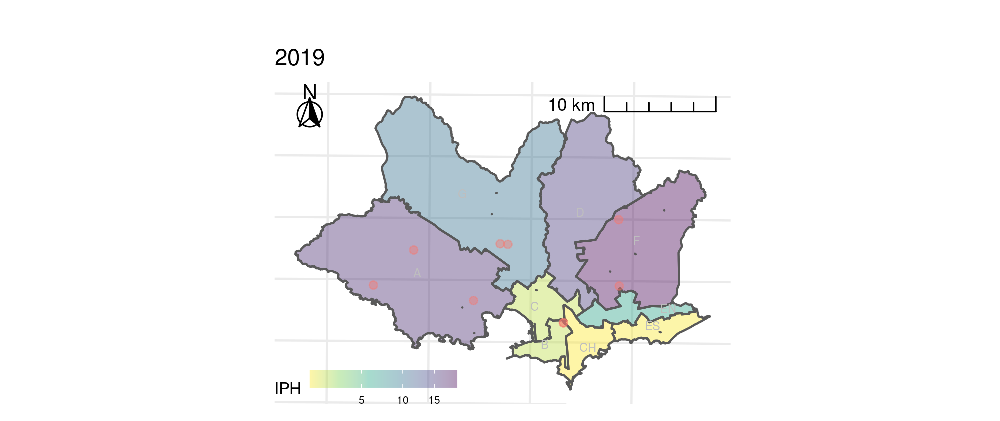

knitr::include_graphics("images/g9-4.png")
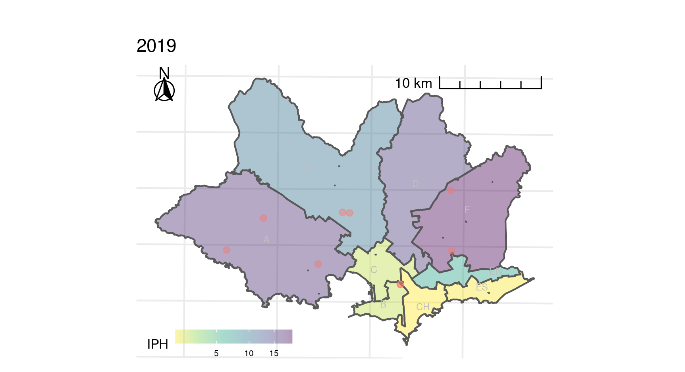
```


Si bien la IPP se redujo entre 2010 y 2019 a nivel de municipios, en términos relativos, para todos los años considerados, se mantienen las desigualdades en tanto los niveles más altos se observan en la periferia de Montevideo, y los más bajos en la costa. Podemos resumir el resultado de los mapas del Gráfico 9, en un solo mapa que agregue la IPP del período 2010-2019 y la respectiva tasa de feminicidios por municipio. El Gráfico 10 clasifica los municipios de Montevideo en 5 niveles según su IPP, un color más oscuro indica una mayor proporción de personas en situación de pobreza, mientras que un color más claro lo contrario. Un análisis visual, permite observar a grandes rasgos y sin considerar otros factores, que los municipios con mayores (menores) valores de la IPP parecen presentan mayores (menores) niveles de la TF, con excepción de los municipio B, G y D.

<!-- grafico 10 -->
```{r,fig.cap= "Tasa de feminicidios promedio por municipio según incidencia de la pobreza (2010-2019)", fig.asp=0.5}

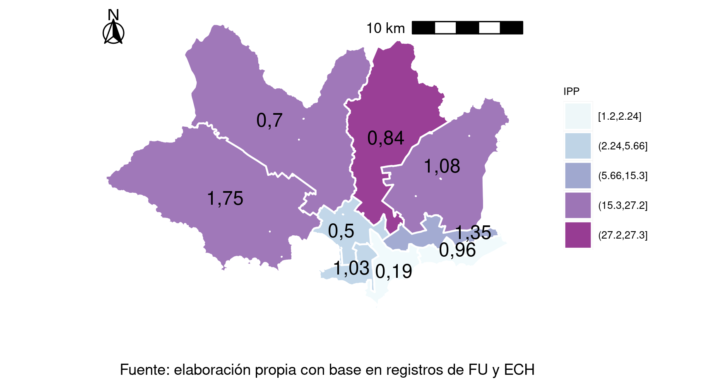
```

Para aumentar el nivel de desagregación, repetimos el ejercicio a nivel de CCZ^[Los CCZs comprenden un área menor que los municipios pero no son una partición de estos, ya que algunos CCZs incluyen porciones de diferentes municipios.]. De esta manera obtenemos territorios más pequeños y homogéneos en cuanto al nivel de la IPP (Gráfico \ref{fig:tasa_ccz}). Más adelante se utilizará un modelo econométrico para estudiar de manera formal estas relaciones.

<!-- grafico 11 -->
```{r, fig.cap = "Tasa de feminicidios promedio por CCZ según incidencia de la pobreza (2010-2019)", fig.asp=0.5}
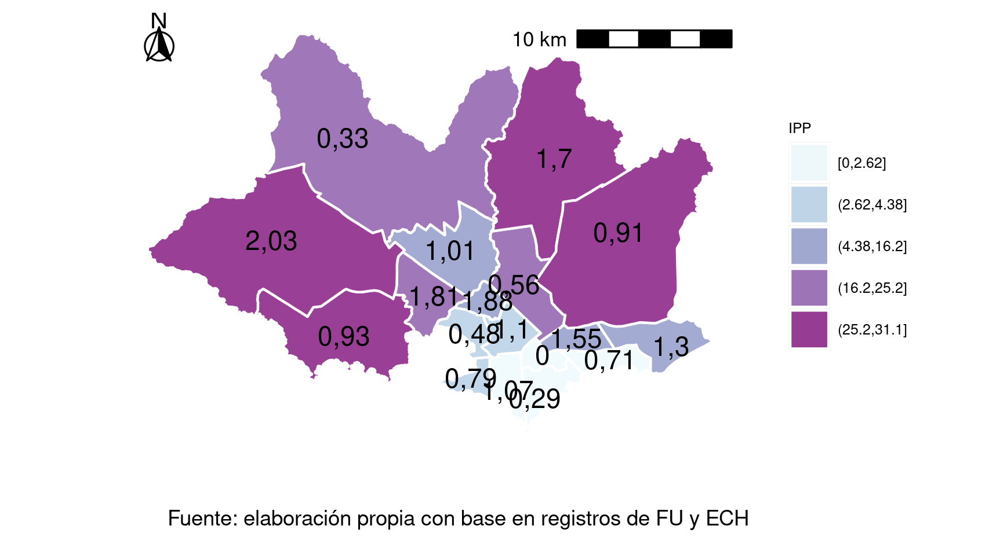
```

Para analizar la presencia de autocorrelación espacial global se estima el estadístico I de Moran para la tasa de feminicidios a diferentes niveles de agregación: municipios, CCZs y barrios de Montevideo. En el cálculo de la I de Moran se debe construir una matriz de pesos espaciales para definir la interdependencia espacial entre las regiones analíticas (municipios, CCZs y barrios, respectivamente). Una forma de representar las relaciones espaciales con datos de área, los polígonos que definen las regiones, es a través del concepto de contigüidad. Se optó por aproximar la contigüidad geográfica a partir de una matriz de pesos espaciales de tipo *queen*^[Recibe este nombre por analogía con los movimientos de la figura de reina en el ajedrez.] de orden uno. Los vecinos contiguos de primer orden se definen como áreas que tienen al menos un límite común.

Se obtiene una I de Moran negativa para municipios y barrios, mientras que para CCZs es
positiva, pero en los tres casos no significativamente diferente de cero. Por lo tanto, no se puede rechazar la hipótesis que indica que los datos se distribuyen aleatoriamente entre municipios (CCZs o barrios) y, por ende, no hay dependencia espacial entre estos. En definitiva, no se pudo confirmar un patrón de autocorrelación espacial de la tasa de feminicidios a nivel de Montevideo lo que indica un patrón aleatorio y una falta de agrupación municipal (tampoco comunal ni barrial) general de las tasas de feminicidios (Tabla 5).

<!-- tabla 5 -->
```{r, fig.pos="H"}
library(knitr);
library(kableExtra)
tab <- read.csv("cuadros/moran.csv")
kable(tab, format = "html", booktabs = TRUE, caption = "Resultados Índice de Moran") %>%
  kableExtra::kable_styling(font_size = 12, latex_options = c("striped", "hold_position")) %>% 
  kableExtra::footnote(general = "elaboración propia",footnote_as_chunk = T, general_title = "Fuente:") #%>%  column_spec(column = 2, width = "7cm", border_right = F)
```


Finalmente se realiza el análisis de autocorrelación local para obtener mapas de clusters
basados en el índice local de Moran (LISA), calculados con 999 permutaciones en el proceso de aleatorización, y una matriz de pesos espaciales con criterio de contigüidad de tipo queen. Se presentan solamente los resultados a nivel de CCZ, ya que para los demás casos no hubo resultados significativos. Los resultados se observan en el mapa de clusters (LISA) ofrece con los lugares significativos estadísticamente coloreados de acuerdo con el tipo de autocorrelación espacial. Los códigos de los colores mostrados en la leyenda son: turquesa, para la clasificación alta-alta, amarillo para la baja-baja, y violeta representa a todos aquellos lugares no significativos (no se identificaron zonas baja-alta ni alta-baja).

Para entender las diferencias espaciales a nivel de CCZs de Montevideo, resulta útil analizar los resultados que muestra el Gráfico 12 con los resultados de los LISA.

<!-- grafico 12 -->
```{r, echo=FALSE, fig.cap="LISA a nivel de CCZs de Montevideo"}
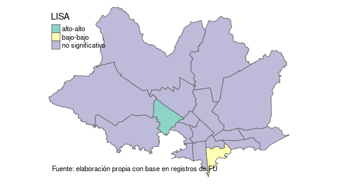
```

Al realizar el análisis tomando como unidades los CCZs, se obtienen dos clusters. Uno, el más grande, en la zona del centro-periferia con un valor alto de la tasa de feminicidios, CCZ 14^[El CCZ 14 está compuesto por los barrios: Prado Norte, Sayago Oeste, Paso Molino, Belvedere, La Teja, Pueblo Victoria, Tres Ombúes, Nuevo París y Villa Teresa.], rodeado de otros CCZs también con valores altos. Esta zona es de nivel socioeconómico relativamente bajo, es decir, con una relativamente alta incidencia de la pobreza. Y otro cluster de valores significativos que rechazan la hipótesis nula de no existencia de autocorrelación espacial, se da en la zona sur, CCZ 5^[El CCZ 5 está compuesto por los barrios: Punta Carretas, Pocitos, Buceo, Parque Batlle y Villa Dolores.], con valores bajos de la tasa de feminicidios rodeado de otros CCZs que también presentan valores bajos en dicha tasa. Como se había analizado antes en este apartado, el primer cluster corresponde a una zona con mayor incidencia de la pobreza y el segundo cluster, corresponde a la zona de menor incidencia de la pobreza. Esta evidencia apoya la hipótesis que guía esta investigación.


### Relación entre la incidencia de la pobreza y los feminicidios en Montevideo

En este apartado se analizará la relación entre la tasa de feminicidios y la incidencia de la pobreza en personas para Montevideo considerando estos indicadores para el período 2010-2019. Se espera encontrar una relación positiva que vaya en línea con la hipótesis planteada que establece que la falta de autonomía económica o menor nivel socioeconómico de las mujeres, ante la ausencia de una política pública efectiva, las expone más a sufrir un feminicidio. Es importante recalcar que la autocorrelación no implica causalidad, sino una asociación entre variables. A su vez, la hipótesis que guía esta investigación tampoco está planteada como una causalidad entre el nivel socioeconómico y el feminicidio, sino que el primero es un factor de vulnerabilidad que condiciona la salida de las mujeres que están en situaciones de VBG. Como vimos en el apartado anterior y se vio reflejado en otras investigaciones comentadas en la Introducción, los feminicidios en Uruguay se caracterizan por ocurrir en su mayoría en el marco de relaciones de pareja entre mujer y varón. Por lo tanto, los feminicidios no son hechos puntuales, sino un devenir de situaciones de VBG en mayor o menor medida sostenidas en el tiempo.

A partir de un análisis econométrico se busca identificar la existencia de una relación entre las características sociodemográficas expresadas en la variable independiente, incidencia de la pobreza en personas ($IPP$) y, la tasa de feminicidios ($TF$) como variable dependiente. De esta manera, se pretende dar respuesta a la pregunta central de esta investigación: ¿Existe relación entre las características socioeconómicas y la tasa de feminicidios en Montevideo para el período 2010-2019? ¿En caso de existir alguna relación, esta depende de la distribución espacial de los feminicidios o éstos se producen aleatoriamente en el territorio? La existencia de una relación espacial se pondrá a prueba mediante un análisis de regresión por Mínimos Cuadrados Ordinarios (MCO). Los MCO tienen como objetivo encontrar variables con una relación lineal positiva con la tasa de feminicidios.

Se plantean tres modelos de regresión, uno por cada nivel de unidad territorial analizada:
municipios, CCZs y barrios. Como resultados obtenemos que los tres modelos son significativos a un 5%, pero conforme la región considerada es más pequeña, la bondad de ajuste del modelo disminuye pasando de un modelo para municipios que explica el 57% de la varianza de los datos, a otro modelo a nivel de CCZ que explica un 38% y por último, el modelo a nivel de barrios explica tan solo un 9%.

En la Tabla 6, se presentan los resultados de los modelos que resultaron significativos, se indican con la letra M los modelos a nivel de municipios, con la C a nivel de CCZ y con la letra B a nivel de barrios. Los números del 1 al 3 indican el tipo de modelo^[Para comprobar que no hay un error de especificación del modelo se realizan los tests sobre los residuos para testear normalidad y ausencia de autocorrelación, se comprueban estos supuestos para todos los modelos presentados, con excepción de los modelos para barrio que no cumplen el supuesto de normalidad de los residuos.] utilizado, log-lineal, lineal y log-log, respectivamente.

<!-- tabla 6 -->
```{r, eval = TRUE}
tab <- read.csv("cuadros/elegidos.csv")
names(tab)[1] <- c(""); names(tab)[ncol(tab)] <- c("B2'")
kable(tab, format = "html", booktabs = TRUE, caption = "Resultados modelos MCO") %>%
  kableExtra::kable_styling(font_size = 12, latex_options = c("striped", "hold_position")) %>% 
kableExtra::footnote(general = "elaboración propia",footnote_as_chunk = T, general_title = "Fuente:") %>% 
kableExtra::add_footnote("(·) p-valor entre 0,1 y 0,05; (*) p-valor entre 0,05 y 0,01; (**) p-valor entre 0,01 y 0,001; (***) p-valor menor que 0,01 y 0,001", notation = "alphabet")
```

El nivel explicativo de estos modelos varía, mientras los modelos a nivel de municipios
explican entre el 52% y 57%, a nivel de CCZs se reduce pasando a explicar entre un 30% y 38% y finalmente los modelos a nivel de barrios solo explican un 9% de la varianza de los datos. Salvo en el modelo lineal para barrios (B2’), en el resto no resultaron significativos los modelos que solo consideran los datos de feminicidios cometidos en la vivienda de la mujer asesinada. Respecto al signo del parámetro estimado asociado a la IPP, en todos los casos fue el esperado, en este sentido, un signo positivo implica que la tasa de feminicidios y la IPP se relacionan positivamente. En la medida que aumenta (disminuye) la incidencia de la pobreza en personas, se espera que aumente (disminuya) la
tasa de feminicidios para un área de interés. De todas formas, que un feminicidio ocurra en un lugar no implica que la víctima resida allí, por lo tanto, resulta importante considerar los modelos para los casos en que el femicidio ocurrió en la vivienda de la mujer asesinada.


Si bien estos resultados podrían estar indicando que conforme una región presenta mayores
niveles de pobreza, también se esperaría que presente mayores niveles de la tasa de feminicidios, dado que no se pudo obtener modelos significativos para los datos de los feminicidios ocurridos en la vivienda, esto no es una evidencia en favor de la hipótesis de esta investigación. No obstante, tampoco se puede descartar dicha hipótesis, en la medida que para un 12% de los casos de feminicidios de Montevideo para el período analizado (2010-2019) no se cuenta con información del lugar del crimen, en tanto, ocurrió al interior de la vivienda o fuera de ella. La inclusión de estos casos con la información correspondiente a si ocurrió en la vivienda o fuera de ésta podría modificar estos resultados. A su vez, en los casos que no ocurrieron en la vivienda no se puede descartar que no hayan ocurrido en el barrio donde residía la mujer asesinada.

### Relación entre la cantidad de NBI y los feminicidios en el interior

Para realizar el análisis a nivel de los departamentos del interior del país se presenta un inconveniente con la fuente de datos secundaria: la ECH. Para el interior del país la ECH no garantiza precisión para realizar estimaciones a escalas menores al departamental, por lo tanto, se opta por utilizar el Censo 2011 que permite desagregar la información a nivel de sección censal. A este nivel de agregación se puede contar con bastante detalle al interior de cada departamento. Luego de hacer el procesamiento de la base de datos de feminicidios, se constató que para los casos que ocurrieron en el interior del país si bien se presenta una coordenada, ésta no es la coordenada exacta del lugar del crimen, sino un punto aleatorio dentro de la localidad en que ocurrió. Por lo tanto, los puntos en un segmento sólo indican que han ocurrido feminicidios allí, pero no exactamente donde, mientras que la ausencia total de puntos indica que no ha ocurrido ninguno.


La mitad de los feminicidios en el interior, sin considerar los que ocurrieron en área rural, se produjeron en localidades con 5% de personas con al menos una NBI y solo un 25% de los casos ocurrieron en localidades donde la incidencia de las NBI en personas es del 21,5% o más.

En este caso, no parece tan claro que los feminicidios se concentren en las zonas con más
carencias en términos de NBI. La falta de precisión de los datos impide que podamos analizarlo a un menor nivel de agregación y obtener resultados más certeros.

### Resultados

A modo de resumen se presentan los principales resultados que arrojó el análisis realizado en este capítulo. La tasa de feminicidios para el total país se mantuvo relativamente estable durante todo el período 2001-2019 entre 1,6 y 1,7 feminicidios cada 100.000 mujeres. En particular, la tasa más alta de feminicidios se da en mujeres jóvenes y en edad reproductiva. 522 corresponden a feminicidios de mujeres cisgénero y 10 a mujeres trans. Respecto a la ascendencia étnico-racial de las víctimas, el nivel educativo y sus creencias religiosas, no se tiene información. Avanzar en un análisis interseccional está
limitado para la información que se cuenta acerca de las mujeres asesinadas.

La mayoría de los feminicidios fueron cometidos por la pareja o ex-pareja o un familiar de la mujer asesinada y gran parte de estos ocurrieron en su vivienda. Si se consideran solamente los feminicidios perpetrados por la pareja o ex-pareja de la mujer asesinada, en el 38% de los casos, el feminicida se suicidio o intentó suicidarse luego de cometer el crimen. Esta característica es un patrón bastante frecuente en estos tipos de feminicidios que, como se analizó en el Capítulo 1, se denominan suicidios machistas. Se producen cuando la mujer quiere terminar la relación de pareja o ésta ya terminó, el feminicidio es una forma de negación de esta situación, pero al mismo tiempo, una vez que se produce, ese varón ya no tiene razones para vivir y se autoelimina. Si consideramos únicamente los
feminicidios a mujeres trans, 7 de éstos aún están impunes.

Al considerar solamente los feminicidios perpetrados a menores de edad (12 casos), si se
analiza el parentesco con el feminicida encontramos que un 22% fueron asesinadas por su padre o padrastro, mientras otro 22% fueron asesinadas por su pareja o ex-pareja y en un 2,9% de estos casos, las menores estaban en una pareja abusiva.


Por otro lado, la distribución de los feminicidios no es homogénea en el territorio, las
localidades pequeñas (entre 1000 y 5000 habitantes) y las áreas rurales presentan las tasas de feminicidios más altas. La falta de precisión de las coordenadas del lugar del feminicidio impidió analizar en profundidad para el interior del país la relación entre la tasa de feminicidio y el nivel socioeconómico. Este análisis sí fue posible para Montevideo. En este sentido, el análisis espacial para Montevideo ha proporcionado pruebas empíricas de la concentración de un grupo de CCZs de centro-oeste con altas tasas de feminicidios y otro grupo de CCZs al sur del departamento con bajas tasas de feminicidios. Dado que la zona centro-oeste presenta niveles más altos de incidencia de la pobreza y la
zona sur es la región de Montevideo con niveles más bajos de incidencia de la pobreza, este resultado es una evidencia a favor de la hipótesis planteada en esta investigación.


En definitiva, el análisis estadístico arrojó la existencia de una relación positiva entre la incidencia de la pobreza y la tasa de feminicidios. Sin embargo, estos resultados se constataron considerando todos los datos, no así cuando se utilizaron únicamente los datos de los feminicidios ocurridos en la vivienda. Por lo tanto, sólo parcialmente se puede considerar una evidencia en favor de la hipótesis planteada. Es importante recalcar que para un 12% de los casos no se puedo determinar si el feminicidio ocurrió en la vivienda, por lo que si se contara con este dato los resultados podrían variar.

